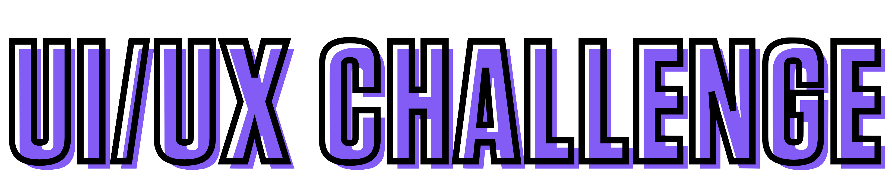

 

# Session Guidelines

## Overview :telescope:

The UI/UX Challenge is an intraschool **tech** and **design** festival. Featuring participants from Grades 6 - 12 in an exciting and fast-paced **5** Day development period. Equipped with 1:1 mentorship sessions, students are placed in an industry like simulation competing for the best of what **tech** and **design** have to offer.

## Competition Outcome :mortar_board:

Teams are to create an **interactive**[1](#f1) UI design for an app[2](#f2) of their choice related to the event themes. Teams can both ideate their own  idea or redesign existing apps related to the event theme. Teams finally prepare a pitch deck showcasing both their ideation, user story and final UI design to a panel of Judges. 

## Awards :trophy:

We know participation certificates are boring. Don't worry we have you covered. All teams will receive personalised letters of recommendation from the panel of judges and mentors. Additionally, winning teams will receive a **trophy** as a memento for their great effort and innovation.

Winners will also receive exclusive scholarship access to an in-house app product development course. 

## Event Themes :earth_asia:

*Event themes are to be unveiled on the 20th of February*

Follow this page for more updates.

## Team Size and Categories :school_satchel:

Teams can have a maximum of 5 participants. Individual students may also participate as a team. Teams can consist of participants from various grades within the given team category.

Team categories are as follows:
- Grades 6 - 7
- Grades 8 - 9
- Grades 10 - 12

## Daily Design Review :mag:

Teams are to submit daily updates of their project work onto the event [Google Classroom](classroom.google.com) page for purposes of authenticity. Teams failing to upload updates once will receive a warning. Teams failing to do so for the second time will be disqualified upon the discretion of the event committee. 

## Recommended Software Suite :dvd:

For newcomers, we recommend the following free tools.

- [Adobe XD](https://www.adobe.com/in/products/xd.html) 
- [Framer](https://www.framer.com/)
- [Figma](https://www.figma.com/)

For advanced users, we recommend the following tools (inclusive of paid):

- [Sketch](https://www.sketch.com/)
- [Invision Studio](https://www.invisionapp.com/studio)
- [Justinmind](https://www.justinmind.com/)

*Participants are of course free to use any software suite that meets their needs the best. Yes, this could also include [PowerPoint](https://www.microsoft.com/en/microsoft-365/powerpoint) or [Keynote](https://www.apple.com/in/keynote/)*

## Judgement Criteria :dart:

- **Innovation:** Originality and creativity of the idea => 25% 

- **Potential Impact for Good:** Impact on community and society => 25% 

- **Accessibility:** Ease of use and navigation => 25%

- **Visual Appeal:** Apt use of design fundamentals to create a cohesive user experience = 25%

## FAQ :question:

 **Q**: Can my friends from other schools join me in the competition?

 **A**: No. This event is only for the students of [Legacy School Bangalore](lsb.edu.in), however, we are working on a Mega Hackathon in Mid - 2021

 **Q**: I have no design or coding experience. Can I still participate?

 **A**: Yes, absolutely. The competition is 0 code-based and open to all regardless of art and design skills. For further assistance kindly refer to the [Developer Handbook](Developer-Handbook.md). 

*|-Work in progress-|*

### Footnotes
---
<b id="f1">1</b>: Designs cannot be plain static images and must have an element of reactivity/animation.[↩](#a1)

<b id="f2">2</b>: Apps can both be mobile, web or desktop.[↩](#a2)